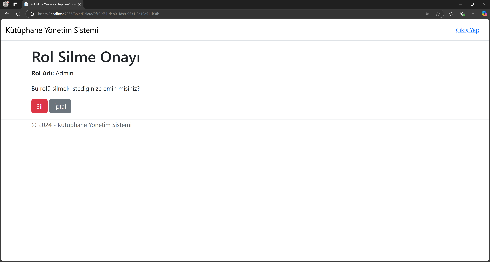

# InveonBootcamp
# Hafta 2

# Kütüphane Yönetim Sistemi
Bu repo, Inveon Bootcamp kapsamında yapılan hafta 2 ödevi için oluşturulmuştur. Bu ödevde, kütüphane yönetim sistemi oluşturulmuştur. Bu kütüphane yönetim sistemi, kullanıcıların kayıt ve giriş işlemlerinin yapıldığı, kullanıcıların yetkilendirme işlemlerinin yapıldığı, kullanıcı yönetimi ve rol yönetimi işlemlerinin yapıldığı bir uygulamadır.

Sayfanın en alt kısmında uygulamanın görselleri bulunmaktadır.

- Deneme yapılacak ortamda veritabanı kurulumu gerektirmemesi sebebiyle SQLite veritabanı kullanılmıştır.
- MVC Tasarım Deseni kullanılmıştır.
- Kitapların kapak resimlerini görüntüleme özelliği eklenmiştir.

- Kitapları listeleme ve görüntüleme işlemleri yapılmıştır.
- Kullanıcı giriş ve kayıt işlemleri yapılmıştır.
- Kullanıcıların yetkilendirme işlemleri yapılmıştır.
- Kullanıcı yönetimi yapılmıştır. (Sadece Admin görebilir)
- Kullanıcıların rol yönetimi yapılmıştır. (Sadece Admin görebilir)
- Kullanıcıların rol atama ve çıkarma işlemleri yapılmıştır. (Sadece Admin görebilir)
- Gerekli yönlendirmeler yapılmıştır

Admin E-mail: admin@kutuphane.com

Admin Parola: Kutuphane12. 

Kitapların ve admin kullanıcı ve rollerinin oluşması için:
- dotnet ef database update

# Sayfa Yapıları ve Görseller

## Kitaplar
https://localhost:7053/Books

https://localhost:7053/Books/Details/id

## Giriş ve Kayıt
https://localhost:7053/Account/Login

https://localhost:7053/Account/Register

## Erişim Engeli
https://localhost:7053/Account/AccessDenied?ReturnUrl=%2FUser%2FList

## Kullanıcı Yönetimi (Sadece Admin Görebilir)
https://localhost:7053/User/Create

https://localhost:7053/User/List

https://localhost:7053/User/Edit/guid

https://localhost:7053/User/Delete/guid

## Rol Yönetimi (Sadece Admin Görebilir)
https://localhost:7053/Role/Create

https://localhost:7053/Role/List

https://localhost:7053/Role/AssignRole/guid

https://localhost:7053/Role/Edit/guid

https://localhost:7053/Role/Delete/guid

# Görseller

